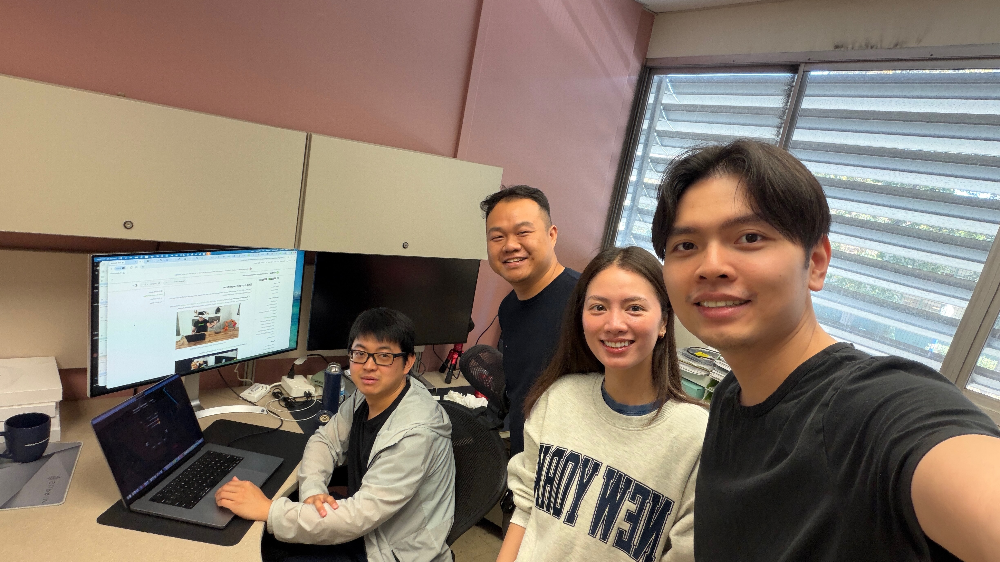

# Advisor Meeting — 2026-09-29

- **Meeting Type:** Advisor
- **Date:** 2026-09-29 (Tuesday)
- **Start–End Time:** During Dr. Liu's office hours, 10:00 AM – 12:00 PM
- **Location/Mode:** In person, Dr. Liu's office hours (E257)

**Attendees:**
- Dr. Kaikai Liu (Project Advisor)
- Lam Nguyen
- Vi Thi Tuong Nguyen
- James Pham

**Photo:** taken 2026-09-29 at 11:19 AM in Dr. Liu's office (time from the original photo metadata).

## 1) Accomplished Since Last Meeting

_Previous advisor meeting: [2026-09-15](2026-09-15-advisor.md). The full write-up is the [2026-09-29 advisor update](../docs/reports/2026-09-29-advisor-update.md)._

- Setup guides 01–07 written ([docs/guides](../docs/guides/README.md)).
- Board audited, and both Python environments built and verified on `sjsujetson-36`. Versions pinned.
- Measurement harness complete: latency percentiles, peak memory, board power, power mode, clock state and git commit in every record. 25 records committed in `results/`.
- Key finding: all experiments will run with the clocks locked.
- Arm research: the Hiwonder kit uses Hiwonder's own servos, not the Feetech STS3215 that LeRobot is built for.

## 2) Accomplished During This Meeting

- Presented the progress update.
- **Agreed overall plan:** CMPE 295A builds the baseline (a VLA policy running on the Jetson, the measurement harness, and simulation evaluation). CMPE 295B improves on or extends that baseline to form the research paper.
- **Arm and testing plan:**
  - Simulate the follower arm first.
  - Once simulation works, deploy the model on the Jetson and bring the board to the lab (ENG276) to test on the lab's real arm.
  - The team will also buy its own leader and follower arms, so testing does not depend on lab hardware.
- **Simulation hardware:** a team member's RTX 4090 (24 GB) will run the simulation. It meets the workstation specification in [guide 06](../docs/guides/06-model-and-simulation.md).
- Dr. Liu shared resources on arm hardware and sim-to-real, sent by email during the meeting (11:13–11:18 AM):
  - [Isaac Sim Sim-to-Real SO-101 Workshop](https://github.com/isaac-sim/Sim-to-Real-SO-101-Workshop)
  - [Seeed reBot-DevArm](https://github.com/Seeed-Projects/reBot-DevArm)
  - [Star-Arm-102](https://github.com/servodevelop/Star-Arm-102)
  - [HighTorque Panthera-HT](https://hightorquerobotics.com/Panthera-HT_Hub/index_en.html)
  - [NVIDIA IsaacCapture](https://nvidia.github.io/IsaacCapture/main/index.html)
  - the ENG276 lab-access form
- After the meeting, all three team members went to ENG276 and completed the DocuSign lab-access form.

## 3) Issues / Blockers

- Lab access is pending Dr. Liu's signature on the form.
- Not yet confirmed whether the lab's SO-ARM101 includes a leader arm as well as the follower. James asked by email at 4:23 PM.
- Arm vendor not chosen. The Hiwonder kit's LeRobot compatibility is unresolved.
- Simulator for a single SO-101 follower not chosen. RoboTwin 2.0's default embodiment is dual-arm, while the Isaac Sim workshop targets the SO-101.
- Admin (sudo) approvals still pending: TensorRT Python bindings and `trtexec`, `dialout` group, power-mode switching.
- Primary model still open: Hy-Embodied-0.5-VLA, as in the abstract, or a lighter fallback such as π0.5. SmolVLA comes first, to test the pipeline.

## 4) Action Items

- Action: Choose and order the team's own leader + follower kit (Feetech STS3215-based unless the Hiwonder kit is confirmed compatible) | Owner: James | Due: 2026-10-09
- Action: Review Dr. Liu's sim-to-real resources, pick the simulator for the SO-101 follower, and install it on the RTX 4090 | Owner: Vi | Due: 2026-10-13
- Action: Run SmolVLA end to end on the Jetson through the harness, on recorded frames, with power sampling. Use the measured memory headroom to recommend the primary model | Owner: Lam | Due: 2026-10-13
- Action: Confirm the lab arm's configuration (leader + follower?) and arrange time on it | Owner: James | Due: 2026-10-06
- Action: Get Dr. Liu's OK for the admin installs and power-mode switching on the board | Owner: James | Due: 2026-10-06
- Action: Write the arm safety layer (joint limits, `max_relative_target` velocity cap, watchdog) before any closed-loop run | Owner: James | Due: before the first arm run
- Action: Decide the target control rate and the primary power mode for the sweep | Owner: All | Due: 2026-10-06
- Action: Submit Workbook 1 | Owner: James, Vi | Due: 2026-10-01, 8:00 AM
- Action: Publish the meeting log in `/meetings/` and submit Meeting Log 1 | Owner: Lam | Due: 2026-10-01, 8:00 AM

## 5) Plans / Goals for Next Meeting

- Arm kit ordered and the lab arm's configuration confirmed.
- Simulator chosen and running the SO-101 follower on the RTX 4090.
- First SmolVLA latency, memory and power numbers from the Jetson.
- Target control rate and primary power mode decided and recorded.

---

### Follow-up after the meeting

- **2026-09-30:**
  - Dr. Liu signed the lab-access form.
  - He invited the team to ENG276 during a NASA Ames lab visit (1–2 PM) to talk with a former student who worked on the lab's robotic arm. The team could not attend.
  - Follow-up: arrange a separate time with that student. Covered by the "confirm the lab arm" action above.
